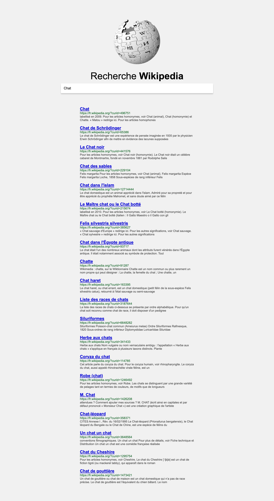

# Création d'une application Wikipédia

-   Projet 3 de la série de 20 projets en JavaScript de l'école du web.
-   Accès à [l'application Wiki](https://vincetalgorn.github.io/VinceTalgorn_EDW_P3_WikiApp/).

## Objectifs

1. Création d'un application Wikipédia
2. Développement avec les langages HTML/CSS/JavaScript
3. Appel et utilisation de l'api fourni par wikipédia

## Notes sur la réalisation du projet

-   L'integration est faite sur l'éditeur Visual Studio Code avec les plugins [Live server](https://marketplace.visualstudio.com/items?itemName=ritwickdey.LiveServer).
-   Le plugin [Prettier](https://marketplace.visualstudio.com/items?itemName=esbenp.prettier-vscode) est également utilisé

## Contact

Vous pouvez me contacter sur le [workplace d'openclassrooms](https://openclassrooms.workplace.com/profile.php?id=100081178936136), sur [twitter](https://twitter.com/TalgornVincent) ou sur mon [adresse mail](mailto:talgorn.v@gmail.com).
